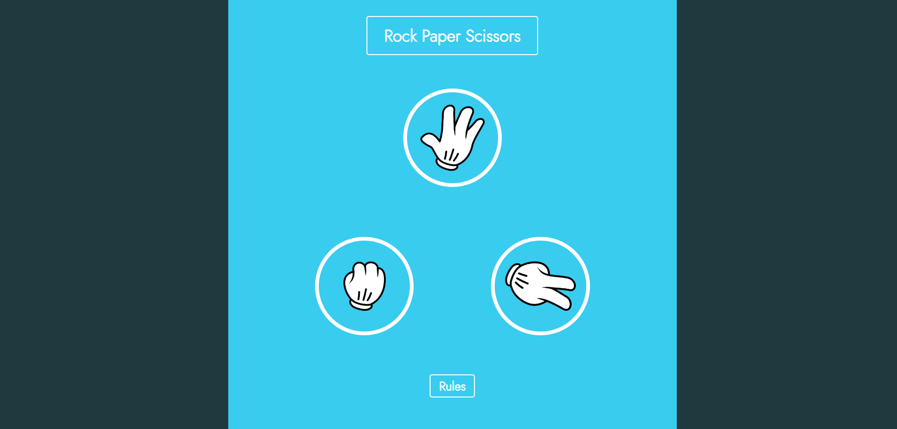

# Game : Rock Paper Scissors

## Apercu du projet

## Présentation

Réalisation d'un projet en HTML, CSS, et JavaScript vanilla.

Le but de ce projet est de réaliser depuis zéro le jeu pierre papier ciseaux. L'utilisateur va pouvoir venir effectuer un choix entre les trois différents éléments, qui sera ensuite comparé à celui de l'ordinateur.

Le résultat du jeu est déterminé par l'application de trois règles simples :

- la pierre gagne face aux ciseaux
- les ciseaux gagnent face au papier
- le papier gagne face à la pierre

Lien vers l'application : https://cyrilclavaud90.github.io/Game-Rock_Paper_Scissors/
